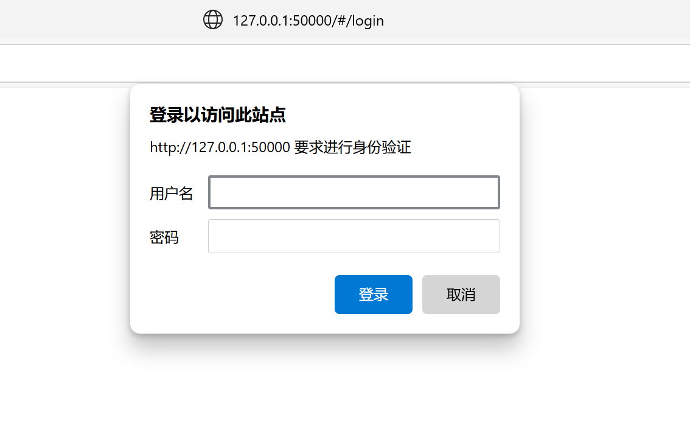

为 Serein 的 API 提供 Basic 验证方式



## 使用方法

开盖即食

- 首次使用时会生成配置文件并要求重新加载
- 需要将 设置-网页-访问凭证 设为空

## 配置文件

```jsonc
{
    // 阻止此插件通过API禁用
    "preventBeingDisabledByApi": true,

    // 用户字典
    "users": {
        "abc": "1234561"
    },

    // 使用旧验证方式(`Authorization: Bearer <token>`)的token列表
    "token": []
}
```
